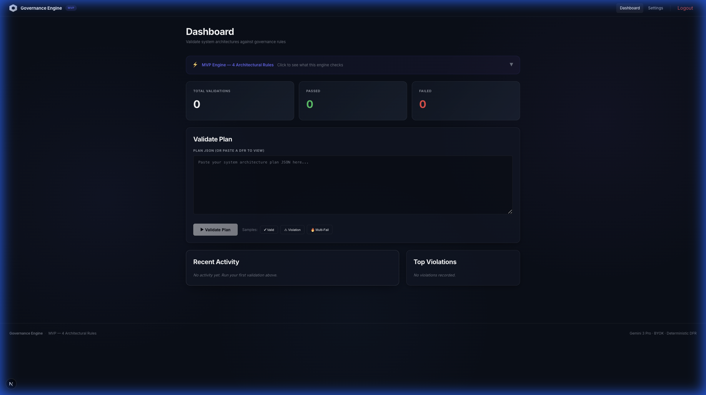
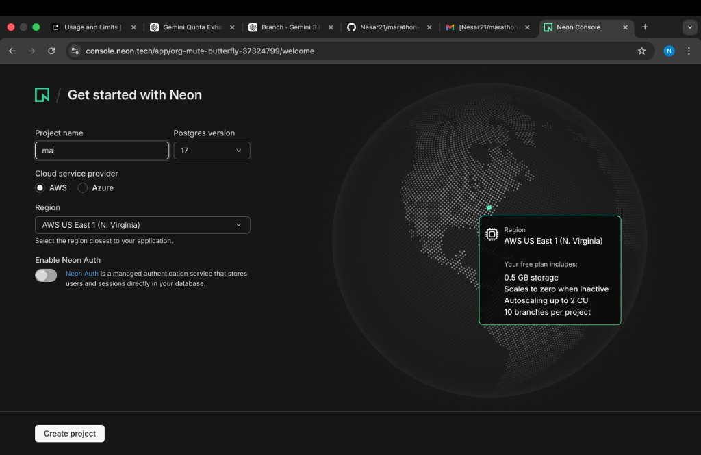
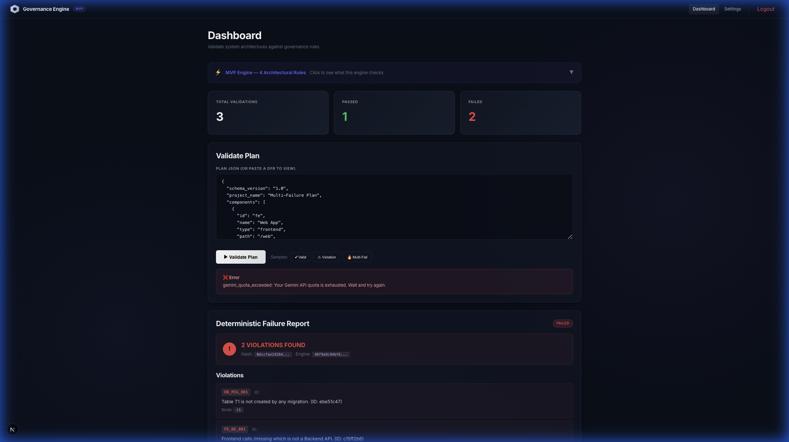
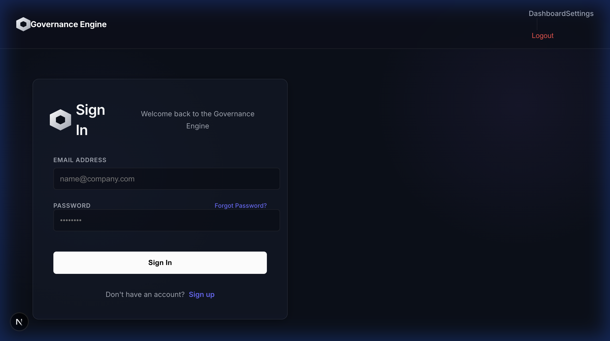

# Governance Engine (MVP)



A simple, powerful tool to analyze your system plans using Dual Model AI. It checks for errors, visualizes relationships, and provides strict safety reports.

---

## ✨ What It Does

### 1. Visualizes Your System
See your system components as an interactive graph. Understand dependencies instantly.


### 2. Dual Intelligence
We use two AI models working together:
- **Primary AI**: Fast and efficient (Gemini 3 Flash).
- **Backup AI**: Strong and reliable (Gemini 2.5 Flash).

Your AI architect suggests improvements:


### 3. Strict Safety Checks
Our DFR (Deterministic Failure Report) Engine runs strict rules to find logical errors, independent of AI.

### 4. Secure & Private (BYOK)
Bring Your Own Key. Your AI keys are never stored permanently.

---

## 🚀 Key Features

- **Dark Mode UI**: Easy on the eyes.
- **Real-Time Analysis**: Get feedback instantly.
- **Secure Login**: JWT Authentication.
- **Interactive Reports**: Click on nodes to see details.



---

## 🏁 How to Run

1. **Install Dependencies**:
   ```bash
   pip install -r backend/requirements.txt
   cd frontend && npm install
   ```
2. **Start Backend**:
   ```bash
   python -m backend.app.main
   ```
3. **Start Frontend**:
   ```bash
   npm run dev
   ```
4. **Open Browser**:
   `http://localhost:3000`

---

*Simple, Fast, and Reliable System Governance.*
