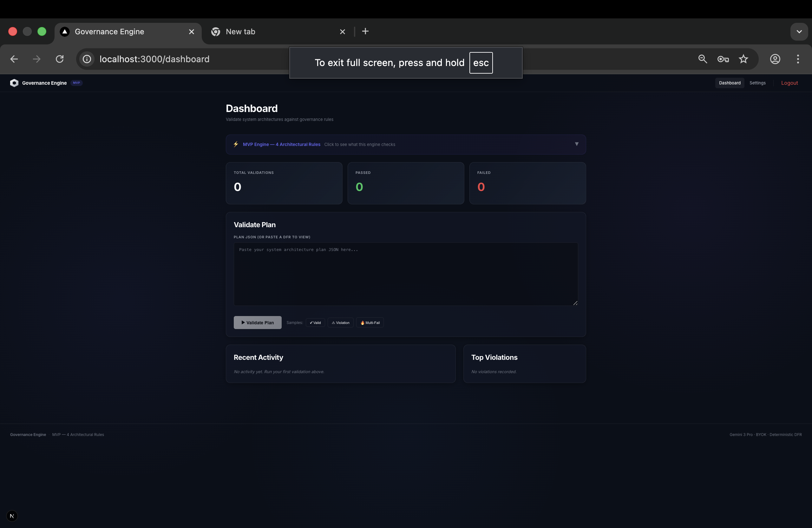
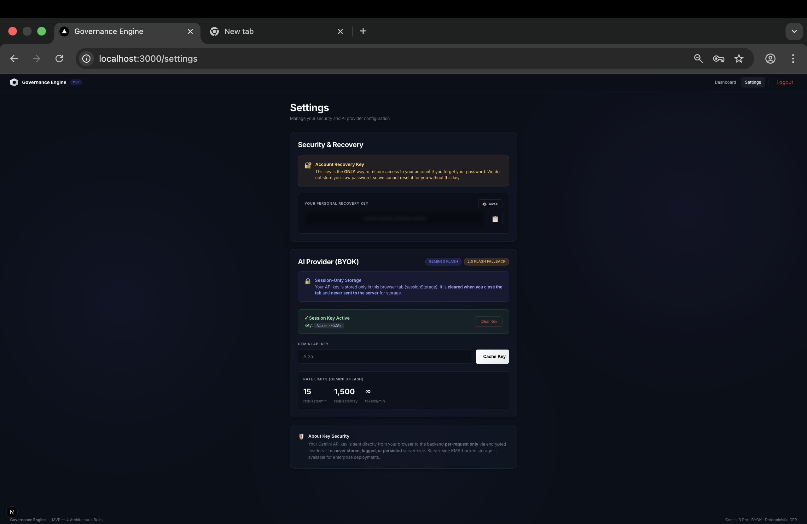

# Marathon Agent

State-driven, resume-capable AI code generation system

---

## Overview

Marathon Agent is a production-oriented AI code generation framework designed for
quota-aware, interruptible execution with deterministic resume capabilities.

It is built as a layered system where:
- LLMs are used only for reasoning and generation
- Deterministic code governs state, safety, and validation
- Persistent artifacts (ledger + contract) are the sole source of truth

The system is designed to survive:
- Rate limits
- Process termination
- Restarts
- Long-horizon execution

without losing architectural identity or execution integrity.

---

## Screenshots

### Dashboard


### AI Suggestions


### Failure Report


### Settings


---

## Layer 1: State & Identity (COMPLETE)

Layer 1 is the foundation of the system.
It answers one question only:

"What is the authoritative state of this run, and can it be trusted?"

### Responsibilities

- Execution identity (session_id)
- Immutable plan identity (architecture contract hash)
- Append-only execution history (progress ledger)
- Deterministic resume eligibility
- Quota-safe halting
- Evidence preservation for audit and DFR

### Explicit Non-Responsibilities

Layer 1 does NOT:
- Plan
- Reason
- Generate code
- Validate correctness
- Repair failures
- Adapt behavior

It enforces truth, not intelligence.

---

## Key Features

- Resume-first design  
  All state is persisted to disk. No RAM state is trusted across runs.

- Artifact authority  
  The progress ledger and architecture contract are the only sources of truth.

- Cryptographic integrity  
  SHA-256 hashes for:
  - Architecture contract (canonical JSON)
  - Generated files (checksums)

- Append-only semantics  
  Ledger entries are strictly ordered by UTC ISO-8601 timestamps.

- Clean failure handling  
  Exit codes define recovery strategy explicitly.

---

## Project Structure
```
Marathon_agent/
├── state_layer/                  # Layer 1: State & Identity
│   ├── __init__.py               # Public API
│   ├── types.py                  # Core types and contracts
│   ├── session_manager.py        # Single entry point for execution
│   ├── resume_gate.py            # 6-point resume validation
│   ├── ledger.py                 # Progress ledger operations
│   ├── ledger_writer.py          # Controlled mutation interface
│   ├── contract.py               # Architecture contract logic
│   ├── lock.py                   # Advisory execution lock
│   └── io.py                     # Atomic fsync-backed writes
├── marathon.py                   # CLI demo for Layer 1
├── test_layer1.py                # Integration tests (Layer 1)
├── test_canonical_hash.py        # Canonical hash unit tests
├── requirements.txt              # Dependencies
└── README.md                     # This file
```

---

## Installation

1. Clone the repository
```bash
git clone https://github.com/Nesar21/Marathon-Agent.git
cd Marathon-Agent
```

2. Create and activate a virtual environment
```bash
python3 -m venv venv
source venv/bin/activate
```

3. Install dependencies
```bash
pip install -r requirements.txt
```

---

## Usage

### Run Layer 1 Demo
```bash
python marathon.py
```

This initializes a session and demonstrates:
- New execution
- Resume detection
- Exit semantics

Upper layers are intentionally stubbed.

---

## Tests

### Layer 1 Integration Tests
```bash
python test_layer1.py
```

Covers:
- New execution
- Resume success
- Resume failure (hash mismatch)
- Illegal state (partial artifacts)

### Canonical Hash Unit Tests
```bash
python test_canonical_hash.py
```

Validates:
- Key ordering invariance
- Nested structure consistency
- Excluded field handling
- Array order sensitivity
- Unicode stability

---

## Architecture Philosophy

### The Ledger Is the State Machine

There is no in-memory FSM.

All state transitions are:
- Explicit
- Append-only
- Persisted to disk

Execution state is reconstructed from artifacts, not memory.

---

### Resume Is Reconstruction, Not Continuation

- Every run gets a new session_id
- Resume means:
  - Load frozen plan
  - Validate ledger
  - Find last committed checkpoint
  - Continue forward

It does NOT mean restoring RAM state.

---

## Exit Codes

| Code | Meaning |
|------|---------|
| `0`  | Success or clean quota halt |
| `1`  | Execution lock held (retry later) |
| `2`  | Resume invalid (manual inspection required) |
| `3`  | Illegal state (partial artifacts) |
| `130`| User abort (SIGINT / SIGTERM) |

Exit codes are part of the formal contract.

---

## Roadmap

- [x] Layer 1: State & Identity
- [ ] Layer 2: Planning Agent
- [ ] Layer 3: Reviewer Gate
- [ ] Layer 4: Generation Engine
- [ ] Layer 5: Validation & DFR
- [ ] Layer 6: Delivery & User Decision

---

## Technical Highlights

- Frozen dataclasses for immutable state
- Atomic fsync-backed file writes
- Canonical JSON hashing for plan identity
- Type-safe APIs with `Optional` and `NoReturn`
- Controlled ledger mutation via `LedgerWriter`
- Zero reliance on in-memory execution state

---

## Author

Nesar  
B.E. Computer Science  
JSS Science and Technology University  
Graduating June 2026

Focus: production-grade AI systems, stateful agents, and deterministic infrastructure.

---

## License

MIT License (pending)
